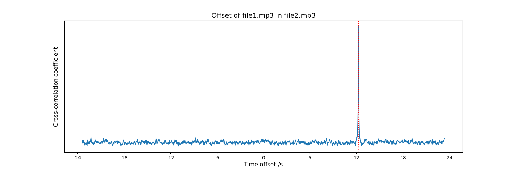

audio-offset-finder
===================

A simple tool and library for finding the offset of an audio file within another file.

Uses cross-correlation of standardised Mel-Frequency Cepstral Coefficients, so should be relatively robust to noise (encoding, compression, etc).  The accuracy is typically to within about 0.01s.

The tool outputs the calculated offset in seconds, and a ["standard score"](https://en.wikipedia.org/wiki/Standard_score) representing the prominence of the chosen correlation peak.  This can be used as an estimate of the accuracy of the calculated offset - one with a score greater than ten is likely to be correct (at least for audio without similar repeated sections) within the accuracy of the tool; an offset with a score less than five is unlikely to be correct, and a manual check should be carried out.  Note that the value of the score depends on the length of the audio analysed.

The tool uses ffmpeg for transcoding, so should work on all file formats supported by ffmpeg.

Installation
------------

To install from this source directory once downloaded:

    $ pip install .

Or, to install the latest package from PyPi.org:

    $ pip install audio-offset-finder

Usage
-----

    $ audio-offset-finder --help
    $ audio-offset-finder --find-offset-of file1.wav --within file2.wav
    Offset: 12.26 (seconds)
    Standard score: 28.99

    $ audio-offset-finder --find-offset-of file2.wav --within file1.wav
    Offset: -12.26 (seconds)
    Standard score: 28.99

To provide additional information about the accuracy of the result in addition to the standard score, the --plot option shows a plot of the cross-correlation curve.  A single well-defined peak such as is shown in the image below is a good indication that the offset is correct.

Testing
-------

    $ pytest

Licensing terms and authorship
------------------------------

See the 'COPYING' and 'AUTHORS' files.

For details of how to contribute changes, see CONTRIBUTING.md.

The audio file used in the tests was downloaded from
[Wikimedia Commons](http://en.wikipedia.org/wiki/File:Tim_Berners-Lee_-_Today_-_9_July_2008.flac),
and was originally extracted from the 9 July 2008 
episode of the BBC [Today programme](http://www.bbc.co.uk/programmes/b00cddwc).
